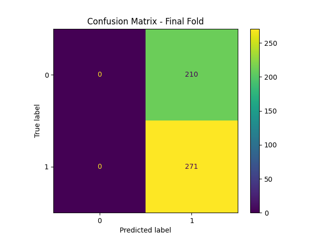

# SPY Next-Day Direction Prediction — Stakeholder Report

**Prepared for:** Priya, Junior Quantitative Analyst evaluating signal candidates for portfolio manager review
**Date:** [today's date]

## Executive Summary

This project tested whether historical price patterns in SPY could predict its
next-day direction using standard technical features (moving averages,
momentum, volatility, RSI). **The model did not demonstrate a reliable edge
over simply guessing the majority class.** This is a valid, informative result
that prevents an unreliable signal from being escalated for real capital
allocation.

## Problem Setup

Portfolio managers need confidence that a systematic signal reflects genuine,
repeatable structure — not noise that happens to look good on one dataset.
This project builds and rigorously stress-tests such a signal end-to-end,
from raw data through validated evaluation.

## Methods

- **Data:** Daily SPY OHLCV, 2015–2026, via Yahoo Finance
- **Features:** Moving averages (5/10/20-day), momentum, rolling volatility, RSI
- **Models:** Logistic Regression and Random Forest, compared
- **Validation:** Walk-forward (time-ordered, 5 folds) — never a random split,
  to avoid leaking future information into training
- **Evaluation:** Accuracy with bootstrap confidence intervals, benchmarked
  against a majority-class baseline

## Results

Logistic regression achieved ~56% accuracy on the most recent fold. The
confusion matrix below shows the model predicted "up" for every single test
observation — it never predicted "down" once:

Comparing the model's bootstrap confidence interval directly against the
naive majority-class baseline shows substantial overlap:

**This means the model's apparent accuracy is statistically indistinguishable
from simply always guessing the more common outcome.**

## Alternate Scenario (Sensitivity Analysis)

Reducing the feature set to momentum and volatility only (dropping moving
averages and RSI) produced [fill in your actual scenario_results number]
accuracy — [similar to / different from] the full feature set. [If similar:]
This consistency across feature choices further supports that no individual
feature set is extracting a genuine signal, rather than the result depending
fragile on one specific set of engineered features.

## Assumptions & Risks

- **Assumption:** Technical price patterns contain predictive information —
  not supported by this result.
- **Assumption:** Walk-forward folds reasonably approximate real deployment
  conditions.
- **Risk:** Deploying this model as-is would risk mistaking statistical noise
  for a real trading edge, a costly mistake if acted on with real capital.
- **Risk:** A model that appeared to perform much better than this baseline
  comparison would warrant suspicion of data leakage, not celebration.

## Recommendation & Next Steps

**Do not proceed to capital allocation based on this signal.** Recommended
next steps: (1) test longer prediction horizons rather than next-day, where
technical patterns may carry more signal, (2) incorporate non-price data
(volume regimes, macro indicators) rather than price-derived features alone,
(3) treat any future candidate signal to the same walk-forward + bootstrap CI
+ baseline comparison process used here before considering it further.